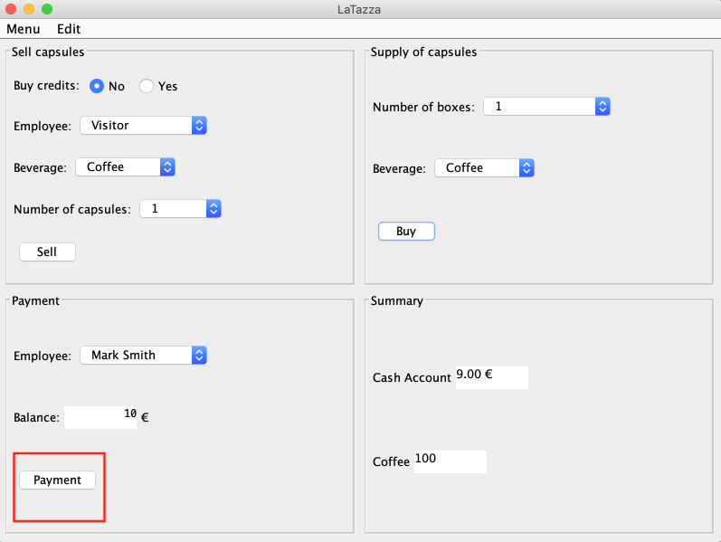
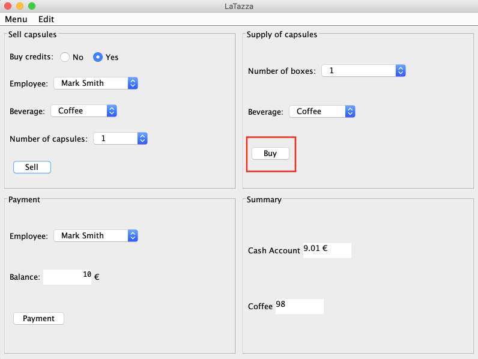
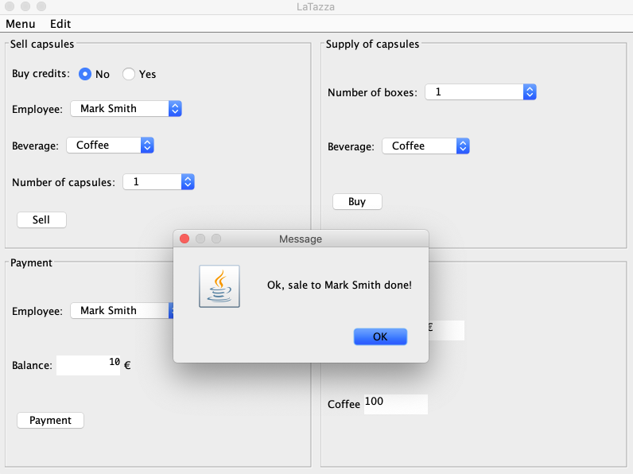
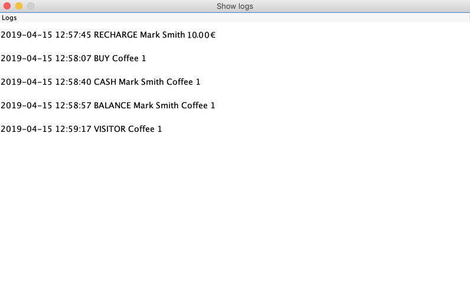

# General instructions for the design

The design of your software project will have to include the packages of the template project provided. You must also consider the classes you added for the Package and Class diagram.

For the design assignment follow the guidelines in the Design Template markdown file provided in the template folder of the repository.

# General instructions for development

The preferred version of Java is *Java 8.0*. You can use any IDE of your choice, but we suggest Eclipse as described in [this document](https://oop.polito.it/doc/ReferenceSoftware_en.html).

To work on the project, you will have to follow these steps:

1. Clone the project in a local folder of your pc using [Git](https://git-scm.com/downloads);
2. From Eclipse IDE, import a Maven project (File -> Import -> Maven -> Existing Maven Projects);
3. Update the project (right click on the project name in the left part of the IDE, then click Maven -> Update Project; enable the checkbox *Force Update of Snapshot/Releases*, then click on *OK*).

At this point you can work on the class `DataImpl.java`. You will find the documentation of the methods in the interface `DataInterface.java`. Do not modify the interface `DataInterface.java` or the signatures of the methods.

You can create whatever class or package you identify as necessary for the implementation of the requirements of the project.

## Data persistency

The final project must implement data persistency. To do so, a database may be needed. If choose to use a database, to make the project portable, you will have to use an embedded database, that is a database that stores the data in local files. [H2](https://www.h2database.com/html/main.html), [DerbyDB](https://db.apache.org/derby/) and [SQLite](https://www.sqlite.org/index.html) are the suggested alternatives for this purpose.

You can also create JSON, XML, or CSV files of your own to store the data of the application, or properly serialize/deserialize Java objects into local files.

## Use of remote libraries

You can also use external libraries, that must be declared in the `pom.xml` file to be imported with Maven.

To do so, add a dependency tag at the end of the `pom.xml` file. The format of the dependency tag is as follows:

```
<dependency>
    <groupId>it.polito.latazza</groupId>
    <artifactId>latazza-gui</artifactId>
    <version>1.0.0</version>
</dependency>
```

You will find the proper tag in the documentation of the library you want to import, or on https://mvnrepository.com/.

After you modify the `pom.xml` file, you have to perform again a Maven Update of the project (see point 2 for details).

## What to upload on the GitLab project

* Implementation of the template project.

## What to NOT upload on the GitLab project

* Binaries;
* IDE configuration files (e.g., `.project`, `.classpath`). Make sure to include them in the `.gitignore` file before committing;
* Database files or other data files. 

# Scheenshots

## Main GUI


## Add a beverage


## Add an employee


# Recharge an account



## Buy boxes of capsules



## Sell capsules to an employee


## Sell capsules to a visitor


## View the logs


## General log


## Employee log

