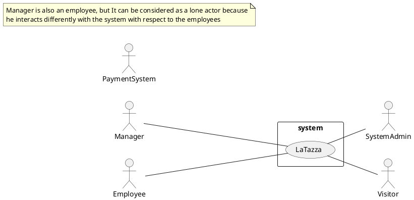

# Context Diagram and interfaces

## Context Diagram

## Interfaces
| Actor | Logical Interface | Physical Interface  |
| ------------- |:-------------:| -----:|
|   Employee    | LaTazza application GUI | They ask to the manager for ordering capsules |
|   Manager    | LaTazza application GUI | Electronical device like personal computer |
|   Visitor    | X | They ask to the manager to get capsules and pay |
|   SystemAdmin    | GUI of the OS used to manage and handle the system | Electronical device like personal computer |
|   PaymentSystem    | Web service and APIs | Internet Connection |