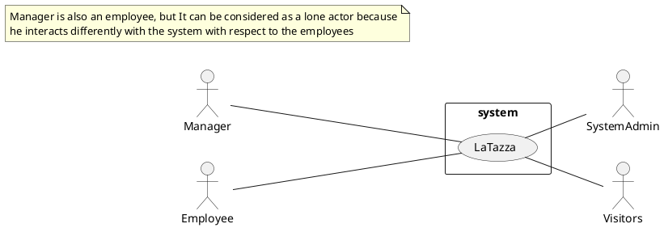

# Context Diagram and interfaces

## Context Diagram

## Interfaces
| Actor | Logical Interface | Physical Interface  |
| ------------- |:-------------:| -----:|
|   Employee    | LaTazza application GUI | They ask to the manager for ordering capsules |
|   Manager    | LaTazza application GUI | Electronical device like personal computer |
|   Visitors    | X | They ask to the manager or employees to get capsules and pay |
|   SystemAdmin    | GUI of the OS used to manage the DB of the order | Electronical device like computer |