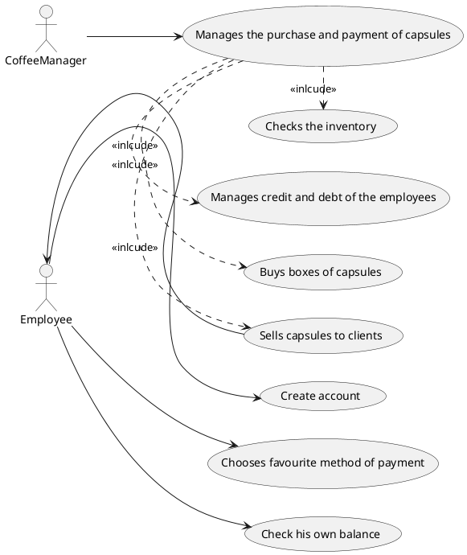

## Use case diagram

```plantuml
@startuml

left to right direction 
skinparam packageStyle rectangle

actor CoffeeManager as c
actor Employee as e

c --> (Manages the purchase and payment of capsules)

(Manages the purchase and payment of capsules) .> (Sells capsules to clients) : <<inlcude>>
(Manages the purchase and payment of capsules) .> (Buys boxes of capsules) : <<inlcude>>
(Manages the purchase and payment of capsules) .> (Manages credit and debt of the employees) : <<inlcude>>
(Manages the purchase and payment of capsules) .> (Checks the inventory) : <<inlcude>>

e <-- (Sells capsules to clients)

e --> (Create account)
e --> (Chooses favourite method of payment)
e --> (Check his own balance)

@enduml
```