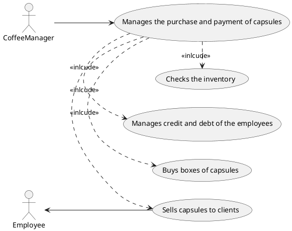

# Use case diagram and use cases

## Use case diagram

## Use Cases

### Use case 1, UC1
| Actors Involved        | Manager, Employee |
| ------------- |:-------------:| 
|  Precondition     | Employee has enough credit for the purchase on their account |  
|  Post condition     | Employee recives his order |
|  Nominal Scenario     | Manager proceed with the order |

### Use case 2, UC2
| Actors Involved        | Manager, Employee |
| ------------- |:-------------:| 
|  Precondition     | Employee has not enough credit for the purchase on their account |  
|  Post condition     | Employee does not recives his order |
|  Nominal Scenario     | Manager notifies the employee of the debt |

### Use case 3, UC3
| Actors Involved        | Manager, Employee |
| ------------- |:-------------:| 
|  Precondition     | Employee has not enough credit for the purchase on their account |  
|  Post condition     | Employee recives his order |
|  Nominal Scenario     | Manager notifies the employee of the debt and proceed with order  |
|  Variants     | The employee pay with cash |

### Use case 4, UC4
| Actors Involved        | Manager, Visitors |
| ------------- |:-------------:| 
|  Precondition     | Visitors pays for the purchase |  
|  Post condition     | Visitors recives his order |
|  Nominal Scenario     | Manager notifies the employee of the debt and proceed with order  |
|  Variants     | The employee pay with cash |

### Use case 5, UC4
| Actors Involved        | Manager, Employee |
| ------------- |:-------------:| 
|  Precondition     | A certain type of capsules is not available |  
|  Post condition     | Employee does not recive his order |
|  Nominal Scenario     | Manager notify the employee |