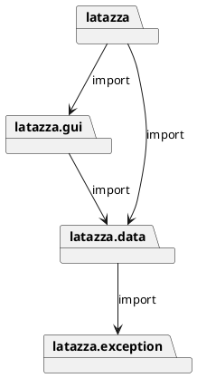
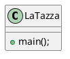
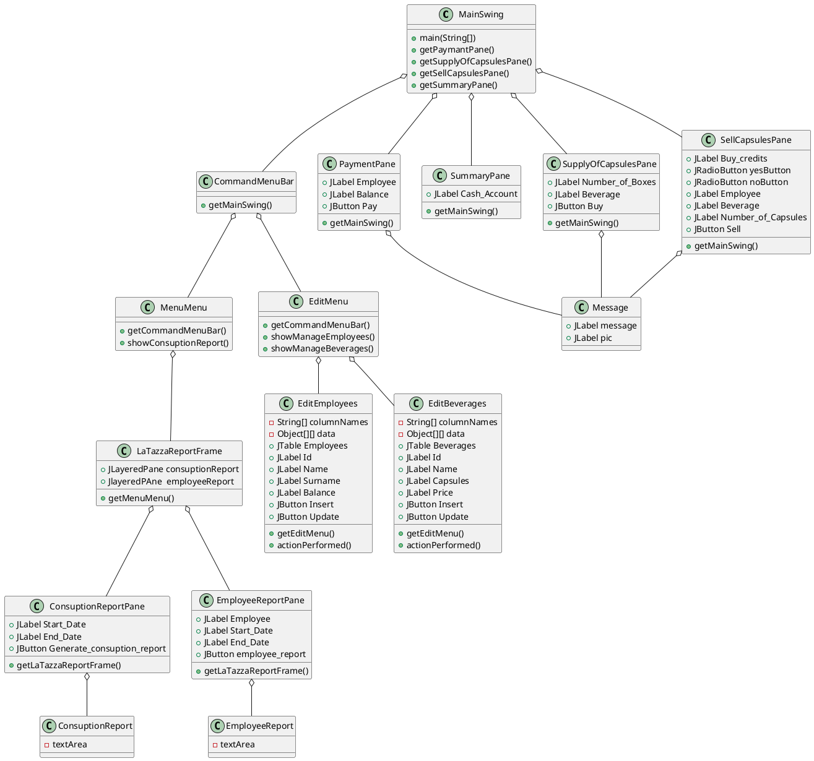

# Design Document Template

Authors: Francesco Dibitonto s265421 Federico Silvio Gorrino s262948 Salvatore Di Martino s267553

Date: 23/04/2019

Version: 1.1

# Contents

- [Package diagram](#package-diagram)
- [Class diagram](#class-diagram)
- [Verification traceability matrix](#verification-traceability-matrix)
- [Verification sequence diagrams](#verification-sequence-diagrams)

# Instructions

The design document has to comply with:
1. [Official Requirement Document](../Official\ Requirements\ Document.md)
2. [DataInterface.java](../src/main/java/it/polito/latazza/data/DataInterface.java)

UML diagrams **MUST** be written using plantuml notation.

# Package diagram

By importing the LaTazza project into Eclipse and inspecting the packages, and by looking at the first lines of code of the .java files as well, we recognized the following structure:



We decided to use a 2-Layers Architecture as we have 2 layers: presentation(gui) and application logic(functions) plus Data merged together. <br>
Application logic and Data are both inside the latazza.data package. <br>
Data is serialized and saved inside local output files in the JSON format (in the PC of the manager). <br>
We decided to serialize one file respectively for: Manager Account, Beverages, Employees, Transactions. <br> 
Finally, concerning parallelization, concurrency is not needed so 1 thread only is sufficient.


# Class diagram

We'll use the DataImpl class as a 'facade': it will serve as a single wrapper class and entry point.

## latazza Class diagram



## latazza.data Class diagram

```plantuml
@startuml
allowmixing

interface Datainterface {
    -Employees : Map<Integer,Employee>
    -Beverages : Map<Integer,Beverage>
    -Transactions : Map<Integer,Transaction>
    -account : LaTazzaAccount
    
    +sellCapsules(Integer,Integer,Integer,Boolean) : Integer
    +sellCapsulesToVisitor(Integer,Integer) : void
    +rechargeAccount(Integer,Integer) : Integer
    +buyBoxes(Integer,Integer) : void
    +getEmployeeReport(Integer,Date,Date) : List<String>
    +getReport(Date,Date) : List<String>
    +createBeverage(String,Integer,Integer) : Integer
    +updateBeverage(Integer,String,Integer,Integer) : void 
    +getBeverageName(Integer) : String 
    +getBeverageCapsulesPerBox(Integer) : Integer
    +getBeverageBoxPrice(Integer) : Integer
    +getBeveragesId() : List<Integer>
    +getBeverages() : Map<Integer,String>
    +getBeverageCapsules(Integer) : Integer
    +createEmployee(String,String) : Integer 
    +updateEmployee(Integer,String,String) : void
    +getEmployeeName(Integer) : String
    +getEmployeeSurname(Integer) : String
    +getEmployeeBalance(Integer) : Integer
    +getEmployeesId() : List<Integer>
    +getEmployees() : Map<Integer,String>
    +getBalance() : Integer
    +reset() : void
}

class DataImpl {

    -Employees : Map<Integer,Employee>
    -Beverages : Map<Integer,Beverage>
    -Transactions : Map<Integer,Transaction>
    -account : LaTazzaAccount
    
    +sellCapsules(Integer,Integer,Integer,Boolean) : Integer
    +sellCapsulesToVisitor(Integer,Integer) : void
    +rechargeAccount(Integer,Integer) : Integer
    +buyBoxes(Integer,Integer) : void
    +getEmployeeReport(Integer,Date,Date) : List<String>
    +getReport(Date,Date) : List<String>
    +createBeverage(String,Integer,Integer) : Integer
    +updateBeverage(Integer,String,Integer,Integer) : void 
    +getBeverageName(Integer) : String 
    +getBeverageCapsulesPerBox(Integer) : Integer
    +getBeverageBoxPrice(Integer) : Integer
    +getBeveragesId() : List<Integer>
    +getBeverages() : Map<Integer,String>
    +getBeverageCapsules(Integer) : Integer
    +createEmployee(String,String) : Integer 
    +updateEmployee(Integer,String,String) : void
    +getEmployeeName(Integer) : String
    +getEmployeeSurname(Integer) : String
    +getEmployeeBalance(Integer) : Integer
    +getEmployeesId() : List<Integer>
    +getEmployees() : Map<Integer,String>
    +getBalance() : Integer
    +reset() : void
    -loadEmployees() : Map<Integer, Employee>
    -loadBeverages() : Map<Integer, Beverages>
    -loadTransactions() : Map<Integer, Transactions>
    -loadLaTazzaAccount() : LaTazzaAccount
}

DataImpl --> Datainterface: implements

class PersonalAccount {
    -balance : Integer
    -Transactions : Map<Integer,Transaction>
    
    +getBalance() : Integer
    +setBalance(Integer) : void
    +getTansactions() : Map<Integer,Transaction>
    +addTransaction(Transaction) : void
    +deleteTransaction(Transaction) : void
}

class LaTazzaAccount {
    -total : Integer
    
    +setTotal(Integer) : void
    +getTotal() : Integer
    +toJsonLaTazzaAccount() : void
}

class Employee {
    -name : String
    -surname : String
    -ID : Integer
    -account : PersonalAccount
    
    +getName() : String
    +getSurname() : String
    +setName(String) : void
    +setSurname(String) : void
    +getPersonalAccount() : PersonalAccount
    +setPersonalAccount(PersonalAccount) : void
    +getID() : Integer
    +getAttributes() : List<String>
    +toJsonEmployee() : void
}

class Beverage {
    -ID : Integer
    -Name : String
    -price : Integer
    -quantityperbox : Integer
    -availablequantity : Integer
    
    +getQuantityperBox() : Integer
    +getAvailableQuantity() : Integer
    +getPrice() : Integer
    +getName() : String
    +setName(String) : void
    +setPrice(Integer) : void
    +setQuantityperBox(Integer) : void
    +setAvailableQuantity(Integer) : void
    +getID() : Integer
    +getAttributes() : List<String>
    +toJsonBeverage() : void
}

class BoxPurchase {
    -quantity : Integer
    -beverage : Beverage
    
    +getQuantity() : Integer
    +setQuantity(Integer) : void
    +getBeverage() : Beverage
    +setBeverage(Beverage) : void
    +getString() : String
    +getAttributes() : List<String>
    +toJsonTransaction() : void
}

class Transaction {
    -ID : Integer
    -date : Date

    +getDate() : Date
    +setDate(Date) : void
    +getID() : Integer
    +getString() : String
}

DataImpl <-- "*" Employee
DataImpl <-- "*" Beverage
DataImpl o-- LaTazzaAccount

LaTazzaAccount -- "*" BoxPurchase
LaTazzaAccount -- "*" Consumption

Beverage o-- "*" Consumption
Beverage o-- "*" BoxPurchase

Employee o-- PersonalAccount
PersonalAccount -- "*" Transaction

Transaction <|-- Recharge
Transaction <|-- Consumption
Transaction <|-- BoxPurchase

Transaction "*" --> DataImpl

class Recharge {
    -amount : Integer
    -employee : Employee

    +getAmount() : Integer
    +setAmount(Integer) : void
    +getEmployee() : Beverage
    +setEmployee(Beverage) : void
    +getString() : String
    +getAttributes() : List<String>
    +toJsonTransaction() : void
}

class Consumption {
    -quantity : Integer
    -beverage : Beverage
    -employee : Employee
    -type : String
    
    +getQuantity() : Integer
    +setQuantity(Integer) : void
    +getBeverage() : Beverage
    +setBeverage(Beverage) : void
    +getType() : String
    +setType(String) : void
    +getEmployee() : Employee
    +setEmployee(Employee) : void
    +getString() : String
    +getAttributes() : List<String>
    +toJsonTransaction() : void
}


@enduml
```



## latazza.exception Class diagram


## latazza.gui Class diagram




# Verification traceability matrix


|  | DataImpl |Employee| PersonalAccount | LaTazzaAccount| Beverage | BoxPurchase | Transaction | Recharge | Consumption |
| ----------- |:------:|----------------:| -----:| -----:| -----:   | -----:      | -----:      | -----:   | -----:      |
| FR1  | X    |     X  |      X          |               |    X     |             |          X  |          |   X         |
| FR2  | X    |        |                 |               |    X     |             |    X        |          |   X         |  
| FR3  | X    |        |                 |               |          |             |   X         |      X   |             |   
| FR4  | X    |        |                 |   X           |   X      |      X      |  X          |          |             |    
| FR5  | X    |    X   |          X      |               |          |             |   X         |        X |      X      |   
| FR6  | X    |        |                 |               |          |             |       X     |    X     |   X         |  
| FR7  | X    |        |                 |               |    X     |             |             |          |             |  
| FR8  | X    | X      |         X       |               |          |             |             |          |             |  


# Verification sequence diagrams 

Scenario 1

```plantuml
": Class DataImpl" -> ": Class Beverage": 1: getAvailableQuantity()
activate ": Class Beverage"
": Class Beverage" --> ": Class DataImpl": 2: Integer
": Class DataImpl" -> ": Class Beverage": 3: getPrice()
": Class Beverage" --> ": Class DataImpl": 4: Integer
deactivate ": Class Beverage"
": Class DataImpl" -> ": Class Employee": 5: getPersonalAccount()
activate ": Class Employee"
": Class Employee" --> ": Class DataImpl": 6: PersonalAccount
deactivate ": Class Employee"
": Class DataImpl" -> ": Class PersonalAccount": 7: getBalance()
activate ": Class PersonalAccount"
": Class PersonalAccount" --> ": Class DataImpl": 8: Integer
": Class DataImpl" -> ": Class Beverage": 9: setAvailableQuantity(Integer)
activate ": Class Beverage"
deactivate ": Class Beverage"
": Class DataImpl" -> ": Class PersonalAccount": 10: setBalance(Integer)
deactivate ": Class PersonalAccount"
```

Scenario 2

```plantuml
": Class DataImpl" -> ": Class Beverage": 1: getAvailableQuantity()
activate ": Class Beverage"
": Class Beverage" --> ": Class DataImpl": 2: Integer
": Class DataImpl" -> ": Class Beverage": 3: getPrice()
": Class Beverage" --> ": Class DataImpl": 4: Integer
deactivate ": Class Beverage"
": Class DataImpl" -> ": Class Employee": 5: getPersonalAccount()
activate ": Class Employee"
": Class Employee" --> ": Class DataImpl": 6: PersonalAccount
deactivate ": Class Employee"
": Class DataImpl" -> ": Class PersonalAccount": 7: getBalance()
activate ": Class PersonalAccount"
": Class PersonalAccount" --> ": Class DataImpl": 8: Integer
deactivate ": Class PersonalAccount"
": Class DataImpl" -> ": Class NotEnoughBalance": 9: NotEnoughBalance(Exception)
activate ": Class NotEnoughBalance"
deactivate ": Class NotEnoughBalance"
```