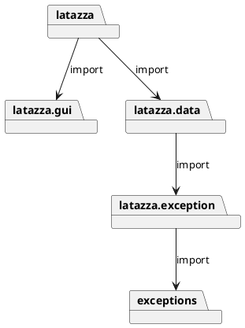
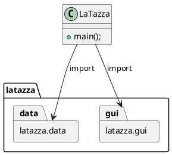
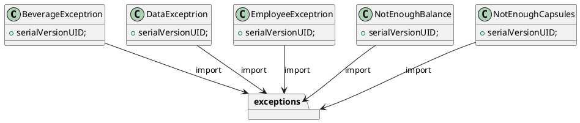
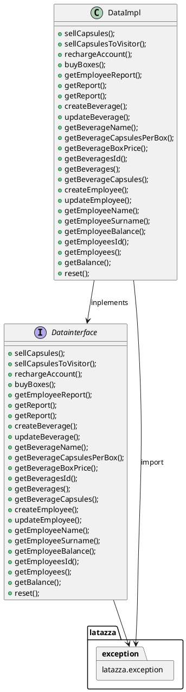
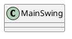

# Design Document Template

Authors:

Date:

Version:

# Contents

- [Package diagram](#package-diagram)
- [Class diagram](#class-diagram)
- [Verification traceability matrix](#verification-traceability-matrix)
- [Verification sequence diagrams](#verification-sequence-diagrams)

# Instructions

The design document has to comply with:
1. [Official Requirement Document](../Official\ Requirements\ Document.md)
2. [DataInterface.java](../src/main/java/it/polito/latazza/data/DataInterface.java)

UML diagrams **MUST** be written using plantuml notation.

# Package diagram

\<define UML package diagram >

\<explain rationales for choices> 

\<mention architectural patterns used, if any>

From the first line of code of the .java files, it is easy to recognise the structure of the UML Diagram.




# Class diagram

\<for each package define class diagram with classes defined in the package>

\<mention design patterns used, if any>

## latazza Class diagram



## latazza.exception Class diagram



## latazza.data Class diagram




## latazza.gui Class diagram



# Verification traceability matrix


|  | DataImpl | BeverageException | DateException | EmployeeException | NotEnoughBalance | NotEnoughCapsules |
| ------------- |:-------------:| -----:| -----:| -----:| -----:| -----:|
| Functional requirement 1  | X | X | X | X | X | X | 
| Functional requirement 2  | X | X | X |   |   | X | 
| Functional requirement 3  | X |   | X | X |   |   |   
| Functional requirement 4  | X | X |   |   | X |   |   
| Functional requirement 5  | X |   | X | X |   |   |   
| Functional requirement 6  | X |   | X |   |   |   |   
| Functional requirement 7  | X |   |   |   |   |   |   
| Functional requirement 8  | X |   | X |   |   |   |   


# Verification sequence diagrams 

Scenario 1

```plantuml
": Class MainSwing" -> ": Class DataImpl": "1: inputTypeOfCapsules()"
": Class MainSwing" -> ": Class DataImpl": "2: inputCollegue()"
": Class DataImpl" -> ": Class MainSwing": "3: response()"
```

Scenario 2

```plantuml
": Class MainSwing" -> ": Class DataImpl": "1: inputTypeOfCapsules()"
": Class MainSwing" -> ": Class DataImpl": "2: inputCollegue()"
": Class DataImpl" -> ": Class NotEnoughBalance": "3: exception()"
": Class NotEnoughBalance" -> ": Class DataImpl": "4: response()"
": Class DataImpl" -> ": Class MainSwing": "5: response()"
```