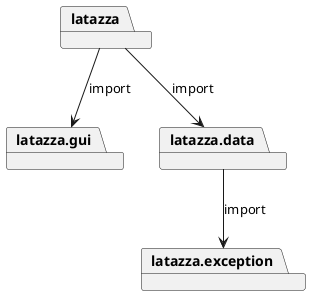
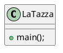
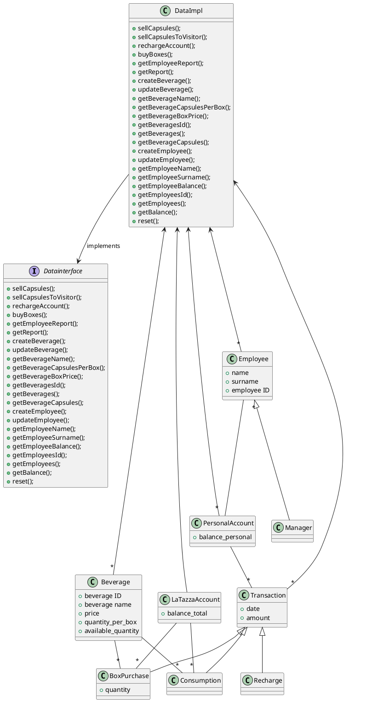
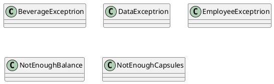
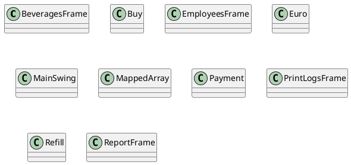

# Design Document Template

Authors:

Date:

Version:

# Contents

- [Package diagram](#package-diagram)
- [Class diagram](#class-diagram)
- [Verification traceability matrix](#verification-traceability-matrix)
- [Verification sequence diagrams](#verification-sequence-diagrams)

# Instructions

The design document has to comply with:
1. [Official Requirement Document](../Official\ Requirements\ Document.md)
2. [DataInterface.java](../src/main/java/it/polito/latazza/data/DataInterface.java)

UML diagrams **MUST** be written using plantuml notation.

# Package diagram

\<define UML package diagram >

\<explain rationales for choices> 

\<mention architectural patterns used, if any>

We decided to use a 3-Layers Architecture: presentation(gui), application logic (functions) and Data (DBMS) for getting the reports. <br>
The Database stores transactions only and its only purpose is to produce reports. <br>
As parallelization is not needed, 1 thread only is sufficient.

By importing the LaTazza project into Eclipse and inspecting the packages, and by looking at the first lines of code of the .java files as well, we recognized the following structure:




# Class diagram

\<for each package define class diagram with classes defined in the package>

\<mention design patterns used, if any>

## latazza Class diagram



## latazza.data Class diagram



## latazza.exception Class diagram




## latazza.gui Class diagram



# Verification traceability matrix


|  | DataImpl | PersonalAccount | LaTazzaAccount| Beverage | BoxPurchase | Transaction | Recharge | Consumption |
| ------------- |:-------------:| -----:| -----:| -----:   | -----:      | -----:      | -----:   | -----:      |
| FR1  | X    |      X          |               |    X     |             |          X  |          |   X         |
| FR2  | X    |                 |               |    X     |             |    X        |          |   X         |  
| FR3  | X    |                 |               |          |             |   X         |      X   |             |   
| FR4  | X    |                 |   X           |   X      |      X      |  X          |          |             |    
| FR5  | X    |          X      |               |          |             |   X         |        X |      X      |   
| FR6  | X    |                 |               |          |             |       X     |    X     |   X         |  
| FR7  | X    |                 |               |    X     |             |             |          |             |  
| FR8  | X    |         X       |               |          |             |             |          |             |  


# Verification sequence diagrams 

Scenario 1

```plantuml
": Class MainSwing" -> ": Class DataImpl": "sellCapsules(employeeId,beverageId,numberOfCapsules,fromAccount)"
": Class DataImpl" -> ": Class Beverage": "getCapsuleType()"
": Class Beverage" --> ": Class DataImpl": "CapsuleType"
": Class DataImpl" -> ": Class Beverage": "updateAmount(numberofCapsules)"
": Class DataImpl" -> ": Class Employee": "getPersonalAccount()"
": Class Employee" --> ": Class DataImpl": "PersonalAccount"
": Class DataImpl" -> ": Class Beverage": "getPrice()"
": Class Beverage" --> ": Class DataImpl": "Price"
": Class DataImpl" -> ": Class PersonalAccount": "updateAmount(Price)"
": Class DataImpl" -> ": Class Transaction": "Transaction(Date,Price)"
```

Scenario 2

```plantuml
": Class MainSwing" -> ": Class DataImpl": "sellCapsules(employeeId,beverageId,numberOfCapsules,fromAccount)"
": Class DataImpl" -> ": Class Beverage": "getCapsuleType()"
": Class Beverage" --> ": Class DataImpl": "CapsuleType"
": Class DataImpl" -> ": Class Beverage": "updateAmount(numberofCapsules)"
": Class DataImpl" -> ": Class Employee": "getPersonalAccount()"
": Class Employee" --> ": Class DataImpl": "PersonalAccount"
": Class DataImpl" -> ": Class Beverage": "getPrice()"
": Class Beverage" --> ": Class DataImpl": "Price"
": Class DataImpl" -> ": Class PersonalAccount": "updateAmount(Price)"
": Class PersonalAccount" -> ": Class NotEnoughBalance": "NotEnoughBalance(Exception)"
```