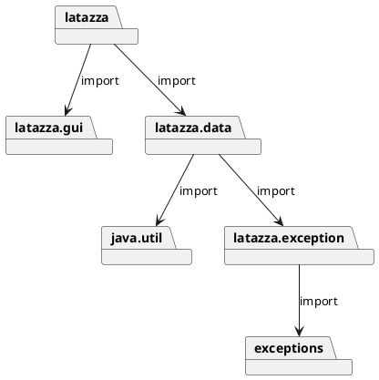

# Design Document Template

Authors:

Date:

Version:

# Contents

- [Package diagram](#package-diagram)
- [Class diagram](#class-diagram)
- [Verification traceability matrix](#verification-traceability-matrix)
- [Verification sequence diagrams](#verification-sequence-diagrams)

# Instructions

The design document has to comply with:
1. [Official Requirement Document](../Official\ Requirements\ Document.md)
2. [DataInterface.java](../src/main/java/it/polito/latazza/data/DataInterface.java)

UML diagrams **MUST** be written using plantuml notation.

# Package diagram

\<define UML package diagram >

\<explain rationales for choices> 

\<mention architectural patterns used, if any>




# Class diagram

\<for each package define class diagram with classes defined in the package>

\<mention design patterns used, if any>

## latazza Class diagram


## latazza.exception Class diagram


## latazza.data Class diagram


## latazza.gui Class diagram


# Verification traceability matrix

\<for each functional requirement from the requirement document, list which classes concur to implement it>


|  | Class x | Class y  | .. |
| ------------- |:-------------:| -----:| -----:|
| Functional requirement x  |  |  | |
| Functional requirement y  |  |  | |
| .. |  |  | |

# Verification sequence diagrams 
\<select key scenarios from the requirement document. For each of them define a sequence diagram showing that the scenario can be implemented by the classes and methods in the design>

```plantuml
": Class X" -> ": Class Y": "1: message1()"
": Class X" -> ": Class Y": "2: message2()"
```