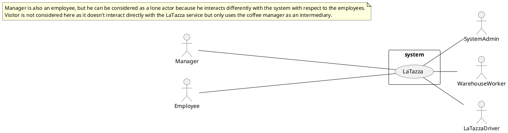
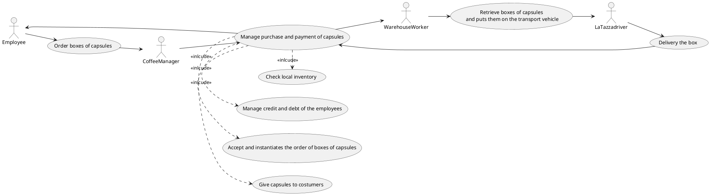
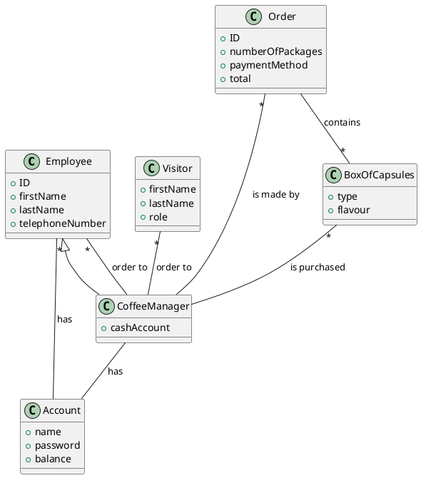
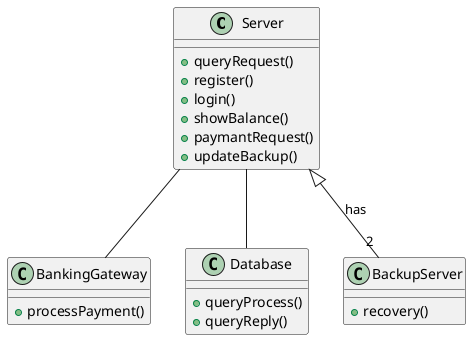

# Requirements Document Template

Authors: Dibitonto Francesco, Di Martino Salvatore, Gorrino Federico Silvio

Date: 9/4/2019

Version: 1.0

# Contents

- [Stakeholders](#stakeholders)
- [Context Diagram and interfaces](#context-diagram-and-interfaces)
	+ [Context Diagram](#context-diagram)
	+ [Interfaces](#interfaces) 
	
- [Stories and personas](#stories-and-personas)
- [Functional and non functional requirements](#functional-and-non-functional-requirements)
	+ [Functional Requirements](#functional-requirements)
	+ [Non functional requirements](#non-functional-requirements)
- [Use case diagram and use cases](#use-case-diagram-and-use-cases)
	+ [Use case diagram](#use-case-diagram)
	+ [Use cases](#use-cases)
	+ [Relevant scenarios](#relevant-scenarios)
- [Glossary](#glossary)
- [System design](#system-design)

# Stakeholders

| Stakeholder name  | Description | 
| ----------------- |:-----------:|
| 	Employee	|	Worker wanting to buy and share a coffee maker; they buy capsules from the manager.	| 
|	Coffee Manager		|	Employee taking charge of managing the purchase and payment of capsules. In particular, he does: sell capsules to clients, buy boxes of capsules (a box contains 50 capsules of the same kind), manage credit and debt of the employees, check the inventory (number of capsules per type), check the cash account.	|	
|	Visitor		|	Customer from outside buying the capsules, cash only.	|
|	Warehouse worker	|	LaTazza' s warehouse worker, retrieving the desired amount of capsule packages from the warehouse and putting it on the transport vehicles.	|
|	LaTazza driver		|	LaTazza driver employee, driving the vehicle that brings the coffee packages to the buyers.	|
|   System Admin    |   Administrator who manages and handles the system.    |

# Context Diagram and interfaces

## Context Diagram

## Interfaces
| Actor | Logical Interface | Physical Interface  |
| ------------- |:-------------:| -----:|
|   Employee    | LaTazza application GUI for employee  | Electronical device like personal computer |
|   Coffee Manager    | LaTazza application GUI for coffe manager | Electronical device like personal computer |
|   System Admin    | LaTazza application GUI to manage and handle the system | Electronical device like personal computer |
|   Warahouse Worker    | LaTazza application GUI for Warehouse Worker  | Palmtop |
|   LaTazza driver    | LaTazza application GUI for the driver | Portable eletronical device |

# Stories and personas

## Role: employee

## Name: Mario Rossi

## Quote:

> What doesn't kill you makes you stronger.

## Background:
**Age:** 59 
**Location:** Torino 
**Marital Status:** Engaged 
**Kids:** No 
**Occupation:** employee 
**Education:** bachelor degree in economy

## Characteristics
* Lazy
* Headstrong
* Committed
* Action Oriented
* Nervous

## Goals/Needs

* Get maximum working results for minimum effort.
* Get a promotion at work.
* Explore the pyramids.

## Frustrations

* Get stuck without a solution to a working problem.
* Be accused to don't work properly.
* Spend too much time for taking a coffee at work.

## BIO:

> Mario was born in Cuneo in 1960. Since he was a little boy he was very smart. Nonetheless he was not very good at school, because he didn't study enough. Later on he decided to enroll in the University of Torino of Economy. After 5 years he got the bachelor degree and started to work in the Fiat Company in the Accounting Department. At the age of 38 he got married with an High School Teacher. He recently got a promotion, but he still wants a better working position. Mario finds very useful to take a coffee twice in the day, but without loosing too much time, otherwise he gets nervous and looses concentration with loss of productivity.

## MOTIVATION

### Incentive:
████████████████████████████████████████░░░░░░░░░░░░░ 

### Fear:

██████████████████████████████████████████████░░░░░░░ 

### Growth:
██████████████████████████████████████████░░░░░░░░░░░ 

### Power:

████████████████████████████████░░░░░░░░░░░░░░░░░░░░░ 

### Social:

█████░░░░░░░░░░░░░░░░░░░░░░░░░░░░░░░░░░░░░░░░░░░░░░░░ 

## PERSONALITY

### Introvert &emsp;&emsp;&emsp;&emsp;&emsp;&emsp;&emsp;&emsp;&emsp;&emsp;&emsp;&emsp;&emsp;&emsp;&emsp;&emsp;&emsp;&emsp;&emsp;&emsp;&emsp; Extrovert
░░░░░░░░░░░░░░░██░░░░░░░░░░░░░░░░░░░░░░░░░░░░░░░░░░░░ 

### Thinking &emsp;&emsp;&emsp;&emsp;&emsp;&emsp;&emsp;&emsp;&emsp;&emsp;&emsp;&emsp;&emsp;&emsp;&emsp;&emsp;&emsp;&emsp;&emsp;&emsp;&emsp; Feeling

░░░░░░░██░░░░░░░░░░░░░░░░░░░░░░░░░░░░░░░░░░░░░░░░░░░░ 

### Sensing &emsp;&emsp;&emsp;&emsp;&emsp;&emsp;&emsp;&emsp;&emsp;&emsp;&emsp;&emsp;&emsp;&emsp;&emsp;&emsp;&emsp;&emsp;&emsp;&emsp;&emsp; Intuition
░░░░░░░░░░░░░░░░░░░░░░░░░░░░░░░░░░░░░░░░░░░██░░░░░░░░ 

### Judging &emsp;&emsp;&emsp;&emsp;&emsp;&emsp;&emsp;&emsp;&emsp;&emsp;&emsp;&emsp;&emsp;&emsp;&emsp;&emsp;&emsp;&emsp;&emsp;&emsp;&emsp; Perceiving

░░░░░░░░░░░░░░░░░░░░░░░██░░░░░░░░░░░░░░░░░░░░░░░░░░░░ 

## Role: manager

## Name: Enrico Pucci

## Quote:

> Surround yourself with only people who are going to lift you higher.

## Background:
**Age:** 49 
**Location:** Los Angeles 
**Marital Status:** Engaged 
**Kids:** 3 
**Occupation:** supervisor 
**Education:** master degree in psicology

## Characteristics
* Responsible
* Open-minded
* Dreamer
* Chill
* Reliable

## Goals/Needs

* Get along with who supervises at work, creating a friendly working environment.
* Get another child.
* Visit New Zealand.

## Frustrations

* Don't get any recognition for his efforts.
* Upset too much someone at work.
* Don't spend enough time with his family.

## BIO:

> Enrico was born in Genova in 1970. He was a very chill boy up to adolescence as well. He was very good at school because of its smartness and its studious attitude. At 20 he enrolled in the University of Trieste of Psicology. After 6 years he got the master degree and worked in the Human Resource Department in several medium sized companies. At the age of 33 he got married with a professional dancer. He married the folowing year and he moved to Los Angeles, to his wife's house. Now he works as supervisor at Walmart. Enrico would like to make a better working environment, making happy who supervises in order to appear less like a boss. Apart from supervising his employees, moderately severely, he would like to satisfy their needs. They always complain about the bad quality of the coffee automatic machines they have in the office, complaining as well about the slowness of such machines.

## MOTIVATION

### Incentive:
██████████████████████████████████████████████░░░░░░░ 

### Fear:

███████████████████████████████████████░░░░░░░░░░░░░░ 

### Growth:
███████████████████████████░░░░░░░░░░░░░░░░░░░░░░░░░░ 

### Power:

████████████████████████████████████████░░░░░░░░░░░░░ 

### Social:

███████████████████████████████████████░░░░░░░░░░░░░░ 

## PERSONALITY

### Introvert &emsp;&emsp;&emsp;&emsp;&emsp;&emsp;&emsp;&emsp;&emsp;&emsp;&emsp;&emsp;&emsp;&emsp;&emsp;&emsp;&emsp;&emsp;&emsp;&emsp;&emsp; Extrovert
░░░░░░░░░░░░░░░░░░░░░░░░░░░░░░░░░░░░░░░░░░░░░░██░░░░░ 

### Thinking &emsp;&emsp;&emsp;&emsp;&emsp;&emsp;&emsp;&emsp;&emsp;&emsp;&emsp;&emsp;&emsp;&emsp;&emsp;&emsp;&emsp;&emsp;&emsp;&emsp;&emsp; Feeling

░░░░░░░░░░░░░░░░░░░░░░░░░░░░░░░░░██░░░░░░░░░░░░░░░░░░ 

### Sensing &emsp;&emsp;&emsp;&emsp;&emsp;&emsp;&emsp;&emsp;&emsp;&emsp;&emsp;&emsp;&emsp;&emsp;&emsp;&emsp;&emsp;&emsp;&emsp;&emsp;&emsp; Intuition
░░░░░░░░░░░░░░░░░░░░░░░░██░░░░░░░░░░░░░░░░░░░░░░░░░░░ 

### Judging &emsp;&emsp;&emsp;&emsp;&emsp;&emsp;&emsp;&emsp;&emsp;&emsp;&emsp;&emsp;&emsp;&emsp;&emsp;&emsp;&emsp;&emsp;&emsp;&emsp;&emsp; Perceiving

░░░░░░░░░░░░░░░░░░░░░░░░░░░░██░░░░░░░░░░░░░░░░░░░░░░░ 

# Functional and non functional requirements

## Functional Requirements

| ID        | Description  |
| ------------- |:-------------:| 
|FR1|The Employee shall be able to send a request to the Coffee Manager to buy boxes of capsules|  
|FR2|The Coffee Manager shall be able to handle the demand of boxes of capsules|
|FR3|The Coffee Manager shall be able to buy the boxes of capsules on the LaTazza application|
|FR4|When an order comes the LaTazza system should be able to comunicate to the Warehouse worker that he has to put the boxes of capsules on the transport vehicle|
|FR5|When the LaTazza driver has the boxes of capsules he shall be able to transport it to the Coffee Manager's company|
|FR6|When the application has a fault the System Admin shall be able to repair it|
|FR7|The system should be able to handle correctly the registation requests of the employees (both the normal employees and the Coffee Manager) and store theirs profiles into the database|
|FR8|The system should be able to handle correctly the payment procedure with the payment system, storing each transaction into the database|
|FR9|The system should be able to send an error notification to the employee, in case of fault|
|FR10|The Coffee Manager shall be able to manage credit and debt of the employees|
|FR11|The Coffee Manager shall be able to check the number of capsules per type in the local inventory|
|FR12|The Coffee Manager shall be able to check the total checkout on his own cash account|
|FR13|The system should be able to warn the Coffe Manager in case the bought quantity of boxes of capsules isn't available in the remote inventory (warehouse)|

## Non Functional Requirements

| ID        | Type (efficiency, reliability, ..)           | Description  | Refers to |
| ------------- |:-------------:| :-----:| -----:|
|NFR1|Reliability|The application must have at most one fault per year|FR6 FR9|
|NFR2|Usability|The system shall be easy to use|FR1 FR2 FR3 FR7 FR8 FR10 FR11 FR12 FR13|
|NFR3|Performance|The payment and registration procedure should last at most 30 seconds|FR1 FR3 FR7 FR8|
|NFR4|Availability|Each different drink product can be unavailable at most for a week|FR2 FR3 FR4 FR5 FR13|
|NFR5|Capacity|The system should be able to save 4Tb of Data|FR7 FR8|
|NFR6|Security|The transaction and the data of all actors should be encrypted|FR1 FR2 FR3 FR7 FR8|
|NFR7|Interoperability|The system should be run on smartphone and pc|FR1 FR2 FR3 FR7 FR8 FR9 FR10 FR11 FR12|
|NFR8|Data integrity|The system adopts a two phase locking mechanism to guarantee coherence and consistance of data|FR7 FR8|
|NFR9|Recoverability|The system transaction steps are written on a safety log, in away in case of fault the transaction can be restored successfully|FR7 FR8|
|NFR10|Recoverability|The system transactions and the customer accounts are also stored on 3 different backup servers|FR6 FR7 FR8 FR9|
|NFR11|Domain|The currency is euros|FR1 FR2 FR3 FR8 FR10 FR12|
|NFR12|Capacity|For each type of capsule the Warehouse shall always store 20 box units|FR4 FR11|

# Use case diagram and use cases

## Use case diagram

### Use case 1, UC1
| Actors Involved        | Manager, Employee |
| ------------- |:-------------:| 
|  Precondition     | Employee has enough credit for the purchase on its account |  
|  Post condition     | Employee receives his order |
|  Nominal Scenario     | Manager proceeds with the order |

### Use case 2, UC2
| Actors Involved        | Manager, Employee |
| ------------- |:-------------:| 
|  Precondition     | Employee has not enough credit for the purchase on its account |  
|  Post condition     | Employee does not receives his order |
|  Nominal Scenario     | Manager notifies the employee of the debt |

### Use case 3, UC3
| Actors Involved        | Manager, Employee |
| ------------- |:-------------:| 
|  Precondition     | Employee has not enough credit for the purchase on its account |  
|  Post condition     | Employee receives his order |
|  Nominal Scenario     | Manager notifies the employee of the debt and proceed with order  |
|  Variants     | The employee pay with cash |

### Use case 4, UC4
| Actors Involved        | Manager, Visitors |
| ------------- |:-------------:| 
|  Precondition     | Visitors pays for the purchase |  
|  Post condition     | Visitors recives his order |
|  Nominal Scenario     | Manager notifies the visitors and proceed with order |

### Use case 5, UC5
| Actors Involved        | Manager, Employee |
| ------------- |:-------------:| 
|  Precondition     | A certain type of capsule is not available |  
|  Post condition     | Employee does not recive his order |
|  Nominal Scenario     | Manager notifies the employee |

# Relevant scenarios
State at which UC the scenario refers to

## Scenario 1

| Scenario ID: SC1        | Corresponds to UC: 1 |
| ------------- |:-------------:| 
| Step#        | Description  |
|1|Employee sends a request to the Coffee Manager (by using the LaTazza application) for the box of capsules|  
|2|The Coffee Manager checks the availability of the box of capsules|
|3|The Coffee Manager performs and checks the employee payment|
|4|The Coffee Manager sends a notification to the employee:"ok"|
|5|The Coffee Managaer instantiates the order on the LaTazza application|
|5|The Warehouse Worker is notified of the order and retrieves the correspondent products|
|6|The Warehouse Worker puts the products on the transport vehicle|
|7|The LaTazza driver deliveries the box to the Coffee Manager|
|8|The Coffee Manager gives the box of capsules to the employee|
|9|Update the database|

## Scenario 2

| Scenario ID: SC2        | Corresponds to UC: 2 |
| ------------- |:-------------:| 
| Step#        | Description  |
|1|Employee sends a request to the Coffee Manager (by using the LaTazza application) for the box of capsules|  
|2|The Coffee Manager checks the availability of the box of capsules|
|3|The Coffee Manager sends a warning to the employee:"credit not available"|
|4|The employee doesn't update the credits and doesn't pay anyway with cash|

## Scenario 3

| Scenario ID: SC3        | Corresponds to UC: 3 |
| ------------- |:-------------:| 
| Step#        | Description  |
|1|Employee sends a request to the Coffee Manager (by using the LaTazza application) for the box of capsules|  
|2|The Coffee Manager checks the availability of the box of capsules|
|3|The Coffee Manager sends a warning to the employee:"credit not available"|
|4|The employee updates the online payment method or pays anyway with cash|
|5|The Coffee Manager performs and checks the employee payment|
|6|The Coffee Manager sends a notification to the employee:"ok"|
|7|The Coffee Managaer instantiates the order on the LaTazza application|
|8|The Warehouse Worker is notified of the order and retrieves the correspondent products|
|9|The Warehouse Worker puts the products on the transport vehicle|
|10|The LaTazza driver deliveries the box to the Coffee Manager|
|11|The Coffee Manager gives the box of capsules to the employee|
|12|Update the database|

## Scenario 4

| Scenario ID: SC4        | Corresponds to UC: 4 |
| ------------- |:-------------:| 
| Step#        | Description  |
|1|The visitor talks to the Coffee Manager for buying the box of capsules|  
|2|The Coffee Manager checks the availability of the box of capsules|
|3|The Coffee Manager takes the cash from the visitor|
|4|The Coffee Managaer instantiates the order on the LaTazza application|
|5|The Warehouse Worker is notified of the order and retrieves the correspondent products|
|6|The Warehouse Worker puts the products on the transport vehicle|
|7|The LaTazza driver deliveries the box to the Coffee Manager|
|8|The Coffee Manager gives the box of capsules to the employee|
|9|Update the database|

## Scenario 5

| Scenario ID: SC5        | Corresponds to UC: 5 |
| ------------- |:-------------:| 
| Step#        | Description  |
|1|Employee sends a request to the Coffee Manager (by using the LaTazza application) for the box of capsules|  
|2|The Coffee Manager checks the availability of the box of capsules|
|3|The Coffee Manager sends a warning to the employee:"box not available"|

# Glossary

# System Design

