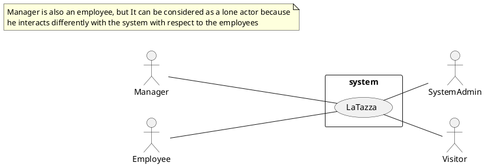
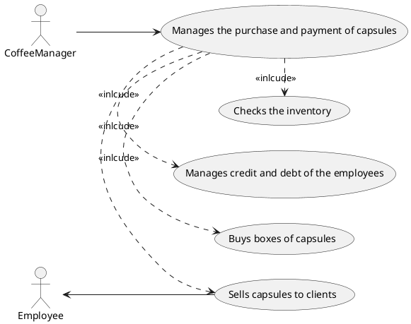
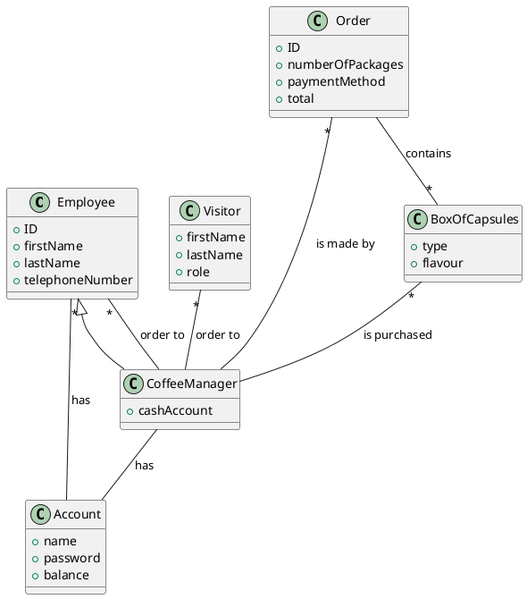

# Requirements Document Template

Authors:

Date:

Version:

# Contents

- [Stakeholders](#stakeholders)
- [Context Diagram and interfaces](#context-diagram-and-interfaces)
	+ [Context Diagram](#context-diagram)
	+ [Interfaces](#interfaces) 
	
- [Stories and personas](#stories-and-personas)
- [Functional and non functional requirements](#functional-and-non-functional-requirements)
	+ [Functional Requirements](#functional-requirements)
	+ [Non functional requirements](#non-functional-requirements)
- [Use case diagram and use cases](#use-case-diagram-and-use-cases)
	+ [Use case diagram](#use-case-diagram)
	+ [Use cases](#use-cases)
	+ [Relevant scenarios](#relevant-scenarios)
- [Glossary](#glossary)
- [System design](#system-design)

# Stakeholders

| Stakeholder name  | Description | 
| ----------------- |:-----------:|
|                   |             | 

# Context Diagram and interfaces

## Context Diagram
\<Define here Context diagram using UML use case diagram>

\<actors are a subset of stakeholders>

## Interfaces
| Actor | Logical Interface | Physical Interface  |
| ------------- |:-------------:| -----:|
|   Employee    | LaTazza application GUI | They ask to the manager for ordering capsules |
|   Manager    | LaTazza application GUI | Electronical device like personal computer |
|   Visitor    | X | They ask to the manager to get capsules and pay |
|   System Admin    | GUI of the OS used to manage and handle the system | Electronical device like p

# Stories and personas
\<A Persona is a realistic impersonation of an actor. Define here a few personas and describe in plain text how a persona interacts with the system>

# Stories and personas
\<A Persona is a realistic impersonation of an actor. Define here a few personas and describe in plain text how a persona interacts with the system>

\<Persona is-an-instance-of actor>  \<stories will be formalized later as use cases>

# Functional and non functional requirements

## Functional Requirements

\<In the form DO SOMETHING, or VERB NOUN, describe high level capabilities of the system> <will match to high level use cases>

| ID        | Description  |
| ------------- |:-------------:| 
|  FR1     |  |  
|  FR2     |  |
|  ...     |  |

## Non Functional Requirements

\<Describe constraints on functional requirements>

| ID        | Type (efficiency, reliability, ..)           | Description  | Refers to |
| ------------- |:-------------:| :-----:| -----:|
|  NFR1     |  |  | FR\<x>|
|  NFR2     |  |  | FR\<y>|
|  ...     |  |  | FR\<x>|

# Use case diagram and use cases

## Use case diagram
\<define here UML Use case diagram UCD summarizing all use cases, and their relationships>

### Use case 1, UC1
| Actors Involved        | Manager, Employee |
| ------------- |:-------------:| 
|  Precondition     | Employee has enough credit for the purchase on their account |  
|  Post condition     | Employee recives his order |
|  Nominal Scenario     | Manager proceeds with the order |

### Use case 2, UC2
| Actors Involved        | Manager, Employee |
| ------------- |:-------------:| 
|  Precondition     | Employee has not enough credit for the purchase on their account |  
|  Post condition     | Employee does not recives his order |
|  Nominal Scenario     | Manager notifies the employee of the debt |

### Use case 3, UC3
| Actors Involved        | Manager, Employee |
| ------------- |:-------------:| 
|  Precondition     | Employee has not enough credit for the purchase on their account |  
|  Post condition     | Employee recives his order |
|  Nominal Scenario     | Manager notifies the employee of the debt and proceed with order  |
|  Variants     | The employee pay with cash |

### Use case 4, UC4
| Actors Involved        | Manager, Visitors |
| ------------- |:-------------:| 
|  Precondition     | Visitors pays for the purchase |  
|  Post condition     | Visitors recives his order |
|  Nominal Scenario     | Manager notifies the visitors and proceed with order  |
|  Variants     | X |

### Use case 5, UC5
| Actors Involved        | Manager, Employee |
| ------------- |:-------------:| 
|  Precondition     | A certain type of capsules is not available |  
|  Post condition     | Employee does not recive his order |
|  Nominal Scenario     | Manager notifies the employee |

# Relevant scenarios
State at which UC the scenario refers to
\<a scenario is a sequence of steps that corresponds to a particular execution of one use case>
\<a scenario is more formal description of a story>
\<only relevant scenarios should be described>

## Scenario 1

| Scenario ID: SC1        | Corresponds to UC:  |
| ------------- |:-------------:| 
| Step#        | Description  |
|  1     |  |  
|  2     |  |
|  ...     |  |

## Scenario 2

...

# Glossary

\<use UML class diagram to define important concepts in the domain of the system, and their relationships>  <concepts are used consistently all over the document, ex in use cases, requirements etc>

# System Design
\<describe here system design> <must be consistent with Context diagram>
