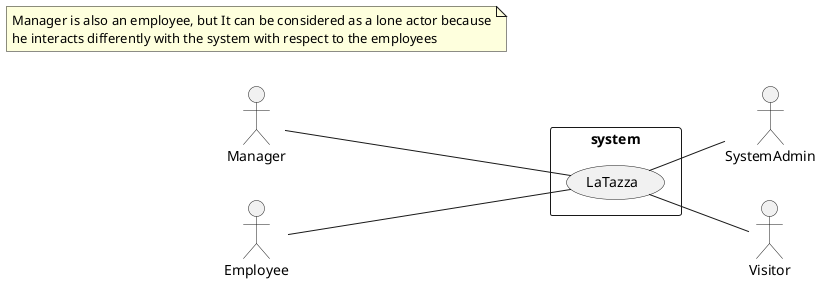
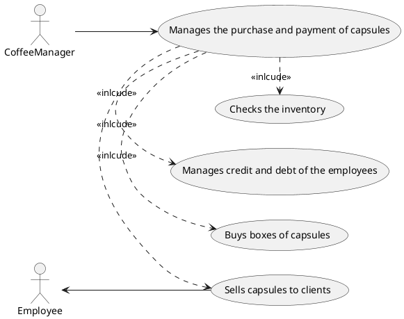

# Requirements Document Template

Authors:

Date:

Version:

# Contents

- [Stakeholders](#stakeholders)
- [Context Diagram and interfaces](#context-diagram-and-interfaces)
	+ [Context Diagram](#context-diagram)
	+ [Interfaces](#interfaces) 
	
- [Stories and personas](#stories-and-personas)
- [Functional and non functional requirements](#functional-and-non-functional-requirements)
	+ [Functional Requirements](#functional-requirements)
	+ [Non functional requirements](#non-functional-requirements)
- [Use case diagram and use cases](#use-case-diagram-and-use-cases)
	+ [Use case diagram](#use-case-diagram)
	+ [Use cases](#use-cases)
	+ [Relevant scenarios](#relevant-scenarios)
- [Glossary](#glossary)
- [System design](#system-design)

# Stakeholders

| Stakeholder name  | Description | 
| ----------------- |:-----------:|
| 	Employee	|	Worker wanting to buy and share a coffee maker; they buy capsules from the manager.	| 
|	Coffee Manager		|	Employee taking charge of managing the purchase and payment of capsules. In particular, he does: sell capsules to clients, buy boxes of capsules (a box contains 50 capsules of the same kind), manage credit and debt of the employees, check the inventory (number of capsules per type), check the cash account.	|	
|	Visitor		|	Customer from outside buying the capsules, cash only.	|
|	Warehouse worker	|	La Tazza' s warehouse worker, retrieving the desired amount of capsule packages from the warehouse and putting it on the transport vehicles.	|
|	La Tazza driver		|	La Tazza driver employee, driving the vehicle that brings the coffee packages to the buyers.	|
|   System Admin    |   Administrator who manages and handles the system.    |

# Context Diagram and interfaces

## Context Diagram
\<Define here Context diagram using UML use case diagram>

\<actors are a subset of stakeholders>

## Interfaces
| Actor | Logical Interface | Physical Interface  |
| ------------- |:-------------:| -----:|
|   Employee    | X | They ask to the manager for ordering capsules |
|   Manager    | LaTazza application GUI | Electronical device like personal computer |
|   Visitor    | X | They ask to the manager to get capsules and pay |
|   System Admin    | GUI of the OS used to manage and handle the system | Electronical device like p

# Stories and personas
\<A Persona is a realistic impersonation of an actor. Define here a few personas and describe in plain text how a persona interacts with the system>

# Stories and personas

## Role: employee

## Name: Mario Rossi

## Quote:

> What doesn't kill you makes you stronger.

## Background:
**Age:** 59 
**Location:** Torino 
**Marital Status:** Engaged 
**Kids:** No 
**Occupation:** employee 
**Education:** bachelor degree in economy

## Characteristics
* Lazy
* Headstrong
* Committed
* Action Oriented
* Nervous

## Goals/Needs

* Get maximum working results for minimum effort.
* Get a promotion at work.
* Explore the pyramids.

## Frustrations

* Get stuck without a solution to a working problem.
* Be accused to don't work properly.
* Spend too much time for taking a coffee at work.

## BIO:

> Mario was born in Cuneo in 1960. Since he was a little boy he was very smart. Nonetheless he was not very good at school, because he didn't study enough. Later on he decided to enroll in the University of Torino of Economy. After 5 years he got the bachelor degree and started to work in the Fiat Company in the Accounting Department. At the age of 38 he got married with an High School Teacher. He recently got a promotion, but he still wants a better working position. Mario finds very useful to take a coffee twice in the day, but wihout loosing too much time, otherwise he gets nervous and looses concentration with loss of productivity.

## MOTIVATION

### Incentive:
████████████████████████████████████████░░░░░░░░░░░░░ 

### Fear:

██████████████████████████████████████████████░░░░░░░ 

### Growth:
██████████████████████████████████████████░░░░░░░░░░░ 

### Power:

████████████████████████████████░░░░░░░░░░░░░░░░░░░░░ 

### Social:

█████░░░░░░░░░░░░░░░░░░░░░░░░░░░░░░░░░░░░░░░░░░░░░░░░ 

## PERSONALITY

### Introvert &emsp;&emsp;&emsp;&emsp;&emsp;&emsp;&emsp;&emsp;&emsp;&emsp;&emsp;&emsp;&emsp;&emsp;&emsp;&emsp;&emsp;&emsp;&emsp;&emsp;&emsp; Extrovert
░░░░░░░░░░░░░░░██░░░░░░░░░░░░░░░░░░░░░░░░░░░░░░░░░░░░ 

### Thinking &emsp;&emsp;&emsp;&emsp;&emsp;&emsp;&emsp;&emsp;&emsp;&emsp;&emsp;&emsp;&emsp;&emsp;&emsp;&emsp;&emsp;&emsp;&emsp;&emsp;&emsp; Feeling

░░░░░░░██░░░░░░░░░░░░░░░░░░░░░░░░░░░░░░░░░░░░░░░░░░░░ 

### Sensing &emsp;&emsp;&emsp;&emsp;&emsp;&emsp;&emsp;&emsp;&emsp;&emsp;&emsp;&emsp;&emsp;&emsp;&emsp;&emsp;&emsp;&emsp;&emsp;&emsp;&emsp; Intuition
░░░░░░░░░░░░░░░░░░░░░░░░░░░░░░░░░░░░░░░░░░░██░░░░░░░░ 

### Judging &emsp;&emsp;&emsp;&emsp;&emsp;&emsp;&emsp;&emsp;&emsp;&emsp;&emsp;&emsp;&emsp;&emsp;&emsp;&emsp;&emsp;&emsp;&emsp;&emsp;&emsp; Perceiving

░░░░░░░░░░░░░░░░░░░░░░░██░░░░░░░░░░░░░░░░░░░░░░░░░░░░ 

# Functional and non functional requirements

## Functional Requirements

| ID        | Description  |
| ------------- |:-------------:| 
|FR1|The Employee shall be able to order the boxes of capsules from the Coffee Manager|  
|FR2|The Visitor shall be able to order the boxes of capsules from the Coffee Manager|
|FR3|The Coffee Manager shall be able to buy the boxes of capsules on the LaTazza web application|
|FR4|When an order comes the LaTazza system should be able to comunicate to the Warehouse worker that he has to put the boxes of capsules on the transport vehicle|
|FR5|When the LaTazza driver has the boxes of capsules he shall be able to transport it to the Coffee Manager's company|
|FR6|When the web application has a fault the System Admin shall be able to repair it|
|FR7|The system should be able to handle correctly the registation requests of the customers and store theirs profiles into its costumer profiles database|
|FR8|The system should be able to handle correctly the payment procedure with the payment system, storing each transaction into the transactions database|
|FR9|The Coffee Manager shall be able to sell the capsules to clients|
|FR10|The Coffee Manager shall be able to manage credit and debt of the employees|
|FR11|The Coffee Manager shall be able to check the number of capsules per type in the inventory|
|FR12|The Coffee Manager shall be able to check the total checkout on his own cash account|

## Non Functional Requirements

| ID        | Type (efficiency, reliability, ..)           | Description  | Refers to |
| ------------- |:-------------:| :-----:| -----:|
|NFR1|Reliability|The web application must have at most one fault per year|FR6|
|NFR2|Usability|The system shall be easy to use|FR1 FR3 FR7 FR8 FR9 FR10 FR11 FR12|
|NFR3|Performance|The payment and registration procedure should last at most 30 seconds|FR1 FR8|
|NFR4|Availability|Each different drink product can be unavailable at most for a week|FR3 FR4 FR5|
|NFR5|Capacity|The system should be able to save 4Tb of Data|FR7 FR8|
|NFR6|Security|The transaction and the data of all actors should be encrypted|FR1 FR7 FR8|
|NFR7|Interoperability|The system should be run on smartphone and pc|FR1 FR3 FR7 FR8 FR9 FR10 FR11 FR12|
|NFR8|Data integrity|The system adopts a two phase locking mechanism to guarantee coherence and consistance of data|FR7 FR8|
|NFR9|Recoverability|The system transaction steps are written on a safety log, in away in case of fault the transaction can be restore successfully|FR7 FR8|
|NFR10|Recoverability|The system transactions and the customer accounts are also stored on 3 different backup servers|FR7 FR8|
|NFR11|Domain|The currency is dollars|FR1 FR2 FR3 FR8
|NFR12|Capacity|The minimum number of capsules per type in the Werehouse is 20|FR4|

# Use case diagram and use cases

## Use case diagram
\<define here UML Use case diagram UCD summarizing all use cases, and their relationships>

### Use case 1, UC1
| Actors Involved        | Manager, Employee |
| ------------- |:-------------:| 
|  Precondition     | Employee has enough credit for the purchase on their account |  
|  Post condition     | Employee recives his order |
|  Nominal Scenario     | Manager proceeds with the order |

### Use case 2, UC2
| Actors Involved        | Manager, Employee |
| ------------- |:-------------:| 
|  Precondition     | Employee has not enough credit for the purchase on their account |  
|  Post condition     | Employee does not recives his order |
|  Nominal Scenario     | Manager notifies the employee of the debt |

### Use case 3, UC3
| Actors Involved        | Manager, Employee |
| ------------- |:-------------:| 
|  Precondition     | Employee has not enough credit for the purchase on their account |  
|  Post condition     | Employee recives his order |
|  Nominal Scenario     | Manager notifies the employee of the debt and proceed with order  |
|  Variants     | The employee pay with cash |

### Use case 4, UC4
| Actors Involved        | Manager, Visitors |
| ------------- |:-------------:| 
|  Precondition     | Visitors pays for the purchase |  
|  Post condition     | Visitors recives his order |
|  Nominal Scenario     | Manager notifies the visitors and proceed with order  |
|  Variants     | X |

### Use case 5, UC4
| Actors Involved        | Manager, Employee |
| ------------- |:-------------:| 
|  Precondition     | A certain type of capsules is not available |  
|  Post condition     | Employee does not recive his order |
|  Nominal Scenario     | Manager notifies the employee |

# Relevant scenarios
State at which UC the scenario refers to
\<a scenario is a sequence of steps that corresponds to a particular execution of one use case>
\<a scenario is more formal description of a story>
\<only relevant scenarios should be described>

## Scenario 1

| Scenario ID: SC1        | Corresponds to UC:  |
| ------------- |:-------------:| 
| Step#        | Description  |
|  1     |  |  
|  2     |  |
|  ...     |  |

## Scenario 2

...

# Glossary

\<use UML class diagram to define important concepts in the domain of the system, and their relationships>  <concepts are used consistently all over the document, ex in use cases, requirements etc>

# System Design
\<describe here system design> <must be consistent with Context diagram>
