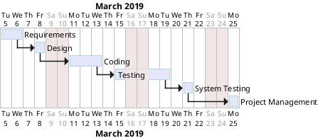

# Project Estimation  template

Authors: Francesco Dibitonto s265421 Federico Silvio Gorrino s262948 Salvatore Di Martino s267553

Date: 5/29/2019

Version: 1.0

# Contents

- [Data from your LaTazza project](#data-from-your-latazza-project)
- [Estimate by product decomposition](#estimete-by-product-decomposition)
- [Estimate by activity decomposition ](#estimate-by-activity-decomposition)

# Data from your LaTazza project

###

|         Total person days worked by your  team, considering period March 5 to April 26 (1 person day == 8 person hours)     |   |             
| ----------- | ------------------------------- | 
|Total Java LoC delivered on April 26 (only code, no Junit code) | 869 |
| Total number of Java classes delivered on April 26 (only code, no Junit code)| 9 |
| Productivity P = LOC/Total person days | 869/(74 hours=9 person days)=96.5 |
|Average size of Java class A = | 96.5 |

# Estimate by product decomposition

### 

|             | Estimate                        |             
| ----------- | ------------------------------- |  
| Estimated n classes   |       10                      |             
| Estimated LOC per class  (Here use Average A computed above )      |        110                    |                
| Estimated effort  (person days) (Here use productivity P)  | 1100/96.5=11.4                                     |      
| Estimated calendar time (calendar weeks) (Assume team of 4 people, 8 hours per day, 5 days per week ) | 5 march - 7 march (half a week)                   |               

# Estimate by activity decomposition

### 

|         Activity name    | Estimated effort    |             
| ----------- | ------------------------------- | 
| Requirements | 5 person days |
| Design | 4 person days |
| Coding | 12 person days |
| Testing | 10 person days |
| System Testing | 4 person days |
| Project management | 4 person days |

###
Insert here Gantt chart with above activities

